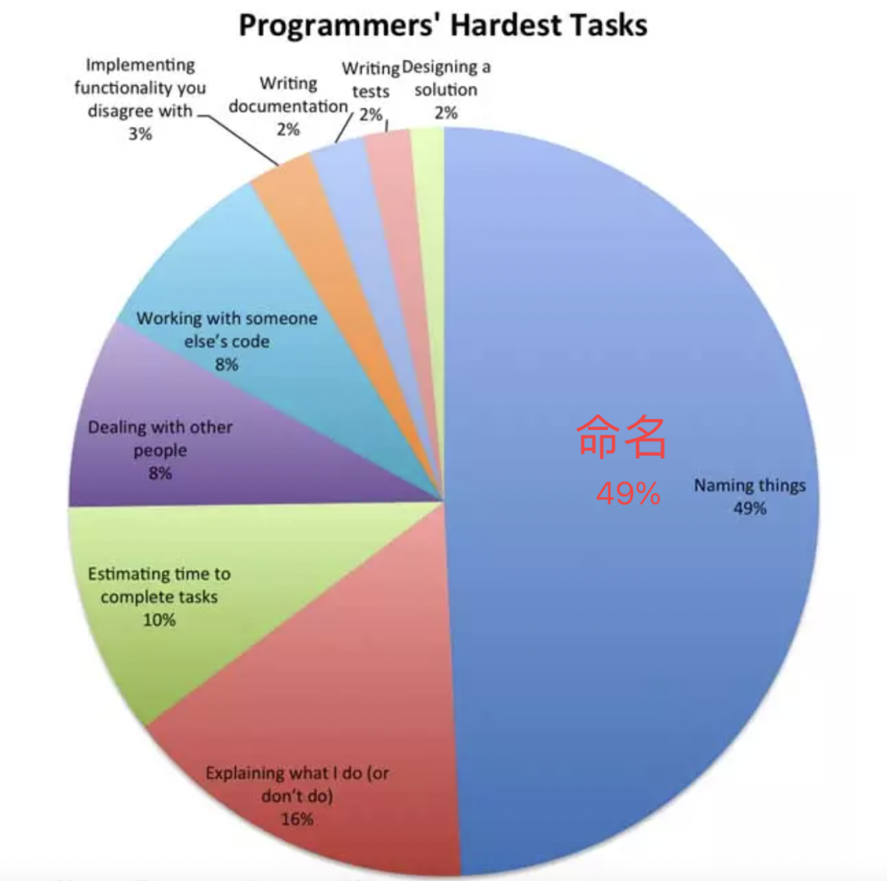

# Naming

在编程工作中，命名是一件让很多开发者都头疼的事情。国外曾经有个一次关于程序员最难任务的投票调查，结果命名占了 49%。



一个好的变量或函数命名，应该能起到自解释的作用，甚至能减少我们代码的注释。

# Naming cheatsheet

- [Naming](#naming)
- [Naming cheatsheet](#naming-cheatsheet)
  - [使用英语](#使用英语)
  - [命名约定](#命名约定)
  - [SID 原则](#sid-原则)
  - [避免过度的简写](#避免过度的简写)
  - [避免上下文重复](#避免上下文重复)
  - [反映预期结果](#反映预期结果)
  - [函数命名](#函数命名)
  - [A/HC/LC 模式](#ahclc-模式)
  - [动作](#动作)
    - [`get`](#get)
    - [`set`](#set)
    - [`reset`](#reset)
    - [`fetch`](#fetch)
    - [`remove`](#remove)
    - [`delete`](#delete)
    - [`compose`](#compose)
    - [`handle`](#handle)
  - [上下文](#上下文)
  - [前缀](#前缀)
    - [`is`](#is)
    - [`has`](#has)
    - [`should`](#should)
    - [`min`/`max`](#minmax)
    - [`prev`/`next`](#prevnext)
  - [单复数](#单复数)

---

命名是一件很困难的事情，[naming-cheatsheet](https://github.com/kettanaito/naming-cheatsheet) 是一个命名备忘录，记录一些常见的规范约定，试图让命名变得更容易。接下来我们就来介绍下 naming-cheatsheet 提到的一些规范约定。

## 使用英语

使用英语来命名变量名和函数名

```js
/* Bad */
const primerNombre = 'Gustavo'
const amigos = ['Kate', 'John']

/* Good */
const firstName = 'Gustavo'
const friends = ['Kate', 'John']
```

> 不管你喜不喜欢，英语都是编程中的主要语言，几乎所有的编程语言的语法都是用英语编写的，以及无数的文档和教材也是。通过英语编写代码，可以大大提高其通用性。对于我们国内开发者来说，一定要避免拼音甚至是直接的中文命名。

## 命名约定

选择一种命名的约定风格，并严格遵守它，可以是 `camelCase`、`ParscalCase`、`snake_case`，或者是其他任何的风格，最重要的是要保持一致。许多编程语言在命名约定方面都有自己的规范，可以查看你所用的语言或者在 GitHub 上学习一些流行的源代码。

```js
/* Bad */
const page_count = 5
const shouldUpdate = true

/* Good */
const pageCount = 5
const shouldUpdate = true

/* Good as well */
const page_count = 5
const should_update = true
```

## SID 原则

命名应该**简短**、**直观**并且具有**描述性**：

- **Short**：简短，避免输入太长；
- **Intuitive**：直观，命名必须自然地阅读，并且尽可能接近自然语言；
- **Descriptive**：以最有效的方式反映其作用或目的。

```js
/* Bad */
const a = 5 // "a" could mean anything
const isPaginatable = a > 10 // "Paginatable" sounds extremely unnatural
const shouldPaginatize = a > 10 // Made up verbs are so much fun!

/* Good */
const postCount = 5
const hasPagination = postCount > 10
const shouldPaginate = postCount > 10 // alternatively
```

## 避免过度的简写

命名要简短，但是要避免钻牛角尖，命名最重要的是要让人能看懂，过度的简写只会降低代码的可读性。

```js
/* Bad */
const onItmClk = () => {}

/* Good */
const onItemClick = () => {}
```

## 避免上下文重复

命名不应与定义命名的上下文重复，如果不降低命名的可读性，请务必从命名中删除该上下文。

```js
class MenuItem {
  /* Method name duplicates the context (which is "MenuItem") */
  handleMenuItemClick = (event) => { ... }

  /* Reads nicely as `MenuItem.handleClick()` */
  handleClick = (event) => { ... }
}
```

## 反映预期结果

命名应该能反映预期的结果。

```jsx
/* Bad */
const isEnabled = itemCount > 3
return <Button disabled={!isEnabled} />

/* Good */
const isDisabled = itemCount <= 3
return <Button disabled={isDisabled} />
```

---

## 函数命名

可以参考以下类似的模式来做命名。

## A/HC/LC 模式

There is a useful pattern to follow when naming functions:

```
prefix? + action (A) + high context (HC) + low context? (LC)
```

Take a look at how this pattern may be applied in the table below.

| Name                   | Prefix   | Action (A) | High context (HC) | Low context (LC) |
| ---------------------- | -------- | ---------- | ----------------- | ---------------- |
| `getUser`              |          | `get`      | `User`            |                  |
| `getUserMessages`      |          | `get`      | `User`            | `Messages`       |
| `handleClickOutside`   |          | `handle`   | `Click`           | `Outside`        |
| `shouldDisplayMessage` | `should` | `Display`  | `Message`         |                  |

> **Note:** 上下文的顺序可能会影响变量的含义，例如 `shouldUpdateComponent` 意味着将要更新一个组件，换一下顺序变成 `shouldComponentUpdate`，意味着组件将做自我更新。
> 换句话说, **High context 强调变量的含义**.

---

## 动作

函数名称的动词部分，是描述函数作用的最终要的部分，如：

- getXXX，表示获取数据
- setXXX，表示设值
- resetXXX，重置数据
- fetchXXX，请求数据
- removeXXX，移除数据，表示从某处删除某物
- deleteXXX，删除数据，表示完全清楚某些事物
- composeXXX，从现有数据创建新数据
- handleXXX，处理某个动作

### `get`

Accesses data immediately (i.e. shorthand getter of internal data).

```js
function getFruitCount() {
  return this.fruits.length
}
```

> See also [compose](#compose).

### `set`

Sets a variable in a declarative way, with value `A` to value `B`.

```js
let fruits = 0

function setFruits(nextFruits) {
  fruits = nextFruits
}

setFruits(5)
console.log(fruits) // 5
```

### `reset`

Sets a variable back to its initial value or state.

```js
const initialFruits = 5
let fruits = initialFruits
setFruits(10)
console.log(fruits) // 10

function resetFruits() {
  fruits = initialFruits
}

resetFruits()
console.log(fruits) // 5
```

### `fetch`

Request for some data, which takes some indeterminate time (i.e. async request).

```js
function fetchPosts(postCount) {
  return fetch('https://api.dev/posts', {...})
}
```

### `remove`

Removes something _from_ somewhere.

For example, if you have a collection of selected filters on a search page, removing one of them from the collection is `removeFilter`, **not** `deleteFilter` (and this is how you would naturally say it in English as well):

```js
function removeFilter(filterName, filters) {
  return filters.filter((name) => name !== filterName)
}

const selectedFilters = ['price', 'availability', 'size']
removeFilter('price', selectedFilters)
```

> See also [delete](#delete).

### `delete`

Completely erases something from the realms of existence.

Imagine you are a content editor, and there is that notorious post you wish to get rid of. Once you clicked a shiny "Delete post" button, the CMS performed a `deletePost` action, **not** `removePost`.

```js
function deletePost(id) {
  return database.find({ id }).delete()
}
```

> See also [remove](#remove).

### `compose`

Creates new data from the existing one. Mostly applicable to strings, objects, or functions.

```js
function composePageUrl(pageName, pageId) {
  return (pageName.toLowerCase() + '-' + pageId)
}
```

> See also [get](#get).

### `handle`

Handles an action. Often used when naming a callback method.

```js
function handleLinkClick() {
  console.log('Clicked a link!')
}

link.addEventListener('click', handleLinkClick)
```

---

## 上下文

函数或方法通常是某些事物的动作，结合上下文，能够明确其操作的对象，或者要能反映出函数预期的数据类型。

```js
/* A pure function operating with primitives */
function filter(list, predicate) {
  return list.filter(predicate)
}

/* Function operating exactly on posts */
function getRecentPosts(posts) {
  return filter(posts, (post) => post.date === Date.now())
}
```

> 一些特定的情况下允许省略上下文，例如在JavaScript中，filter对Array进行操作很常见，就没必要命名为filterArray了。

--

## 前缀

前缀用来增强变量的含义，如：

- is，描述特征或状态，通常是boolean类型
- has，描述是否具有某个状态或值，通常是boolean类型
- should，反映肯定的条件，加上特定的执行动作
- min/max，描述边界或界限时使用
- prev/next，指示前一个或下一个状态

### `is`

Describes a characteristic or state of the current context (usually `boolean`).

```js
const color = 'blue'
const isBlue = color === 'blue' // characteristic
const isPresent = true // state

if (isBlue && isPresent) {
  console.log('Blue is present!')
}
```

### `has`

Describes whether the current context possesses a certain value or state (usually `boolean`).

```js
/* Bad */
const isProductsExist = productsCount > 0
const areProductsPresent = productsCount > 0

/* Good */
const hasProducts = productsCount > 0
```

### `should`

Reflects a positive conditional statement (usually `boolean`) coupled with a certain action.

```js
function shouldUpdateUrl(url, expectedUrl) {
  return url !== expectedUrl
}
```

### `min`/`max`

Represents a minimum or maximum value. Used when describing boundaries or limits.

```js
/**
 * Renders a random amount of posts within
 * the given min/max boundaries.
 */
function renderPosts(posts, minPosts, maxPosts) {
  return posts.slice(0, randomBetween(minPosts, maxPosts))
}
```

### `prev`/`next`

Indicate the previous or the next state of a variable in the current context. Used when describing state transitions.

```jsx
function fetchPosts() {
  const prevPosts = this.state.posts

  const fetchedPosts = fetch('...')
  const nextPosts = concat(prevPosts, fetchedPosts)

  this.setState({ posts: nextPosts })
}
```

## 单复数

变量名称是单数还是复数，取决于值的单数还是复数。

```js
/* Bad */
const friends = 'Bob'
const friend = ['Bob', 'Tony', 'Tanya']

/* Good */
const friend = 'Bob'
const friends = ['Bob', 'Tony', 'Tanya']
```

参考:

- https://jishuin.proginn.com/p/763bfbd3b2af
- https://jishuin.proginn.com/p/763bfbd3abaa
